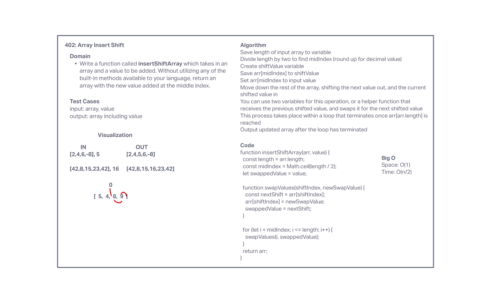

# Insert to Middle of an Array

Write a function called insertShiftArray which takes in an array and a value to be added. Without utilizing any of the built-in methods available to your language, return an array with the new value added at the middle index.

## Whiteboard Process

## Approach & Efficiency

I created variables to facilitate swapping out the old value and swapping the new value into the input array. Along with that, I used the length property to figure out where to start and end the loop of swapping values. I used a for loop and made a helper function to take in the updated swapIndex, and swap value, and update the swap value for the next round.

No data additional data structure was needed, so space is O(1). This method starts simply iterates through the remaining half of the array to shift each value over, so time is O(n/2) which resolves to O(n).
