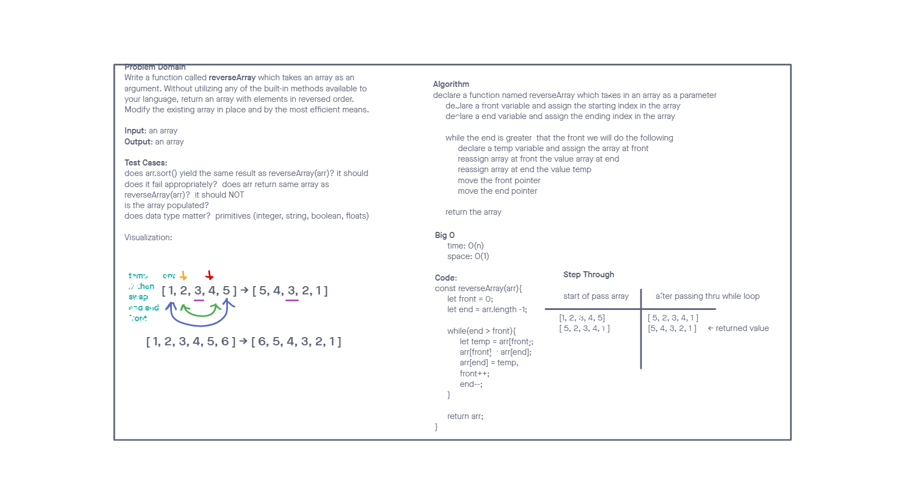

# Reverse an Array

Write a function called reverseArray which takes an array as an argument. Without utilizing any of the built-in methods available to your language, return an array with elements in reversed order.

## Whiteboard Process

## Approach & Efficiency

This challenge was done through mob programming in class with Ryan as the driver. After doing a visualization of the answer, we mobbed the steps of the algorithm to arrive at our solution. We used two tracking variables for the position of the indexes (and a comparison for our end condition), and an additional variable to allow swapping our values in place within the array. This allowed us to have a time and space complexity of O(n) since we didn't have to use extra loops or data structures.
