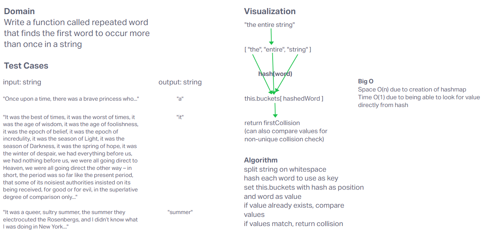

# Hashmap Repeated Word

Write a function called repeated word that finds the first word to occur more than once in a string
Arguments: string
Return: string

## Whiteboard Process

## Approach & Efficiency

I used a hashmap as a means of quickly looking up previously added values. Input string was broken up into individual words, and each word was used as the hash and value. Once a collision occurred, the value was compared to the current word to ensure it was a true match, and not just a collision.

Creating a hashmap of size n made our space O(n), and direct lookup of each value gives us a lookup of O(1), but you still have to iterate through each word in the string, so O(n) for time.

## Solution

[Code](../hastable/index.js)
[Test](../hashtable/__tests__/hashtable.test.js)
