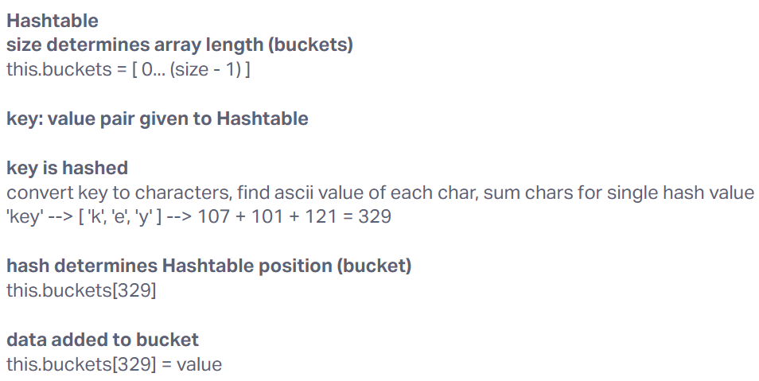

# Hashtable

Implement a Hashtable Class with the following methods:

- set
Arguments: key, value
Returns: nothing
This method should hash the key, and set the key and value pair in the table, handling collisions as needed.
Should a given key already exist, replace its value from the value argument given to this method.
- get
Arguments: key
Returns: Value associated with that key in the table
- has
Arguments: key
Returns: Boolean, indicating if the key exists in the table already.
- keys
Returns: Collection of keys
- hash
Arguments: key
Returns: Index in the collection for that key

## Whiteboard Process

## Approach & Efficiency

Hashtable implementation was mobbed in lecture. The Hashtable is given a size to determine this.buckets array length. hash() converts input key into an integer value within the range of this.buckets array range. In the case of a collision (bucket already has a value), the new value overwrites the previous value. When getting a value, input key is converted using hash() and then calls the relevant bucket directly, returning the value or null if no value is present. keys() returns indices of this.buckets if they contain a value.

By creating a strucuture that allows direct retrieval of a value, when the key is input, we get a Big O time of O(1).

## Solution

[Code](./index.js)
[Tests](./__tests__/hashtable.test.js)
