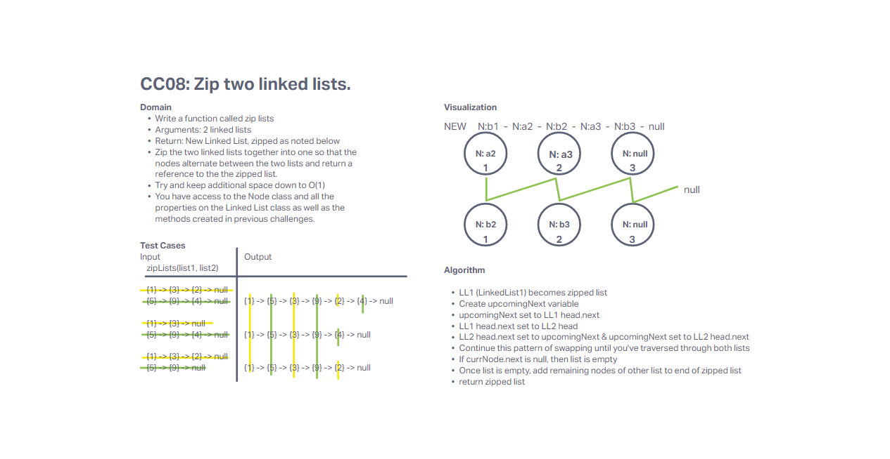

# Linked List Zip

Write a function called zip lists
Arguments: 2 linked lists
Return: New Linked List, zipped as noted below
Zip the two linked lists together into one so that the nodes alternate between the two lists and return a reference to the the zipped list.
Try and keep additional space down to O(1)
You have access to the Node class and all the properties on the Linked List class as well as the methods created in previous challenges.

## Whiteboard Process

## Approach & Efficiency

This challenge was done solo. The domain and test cases were given in the description. I put together the visualization first, and then wrote the algorithm based on the pattern in the visualization. One of the linked lists was used to build the zipped list, keeping the space to O(n) and no extra time complexity was added to looping through the input linked lists, so time was O(n).
