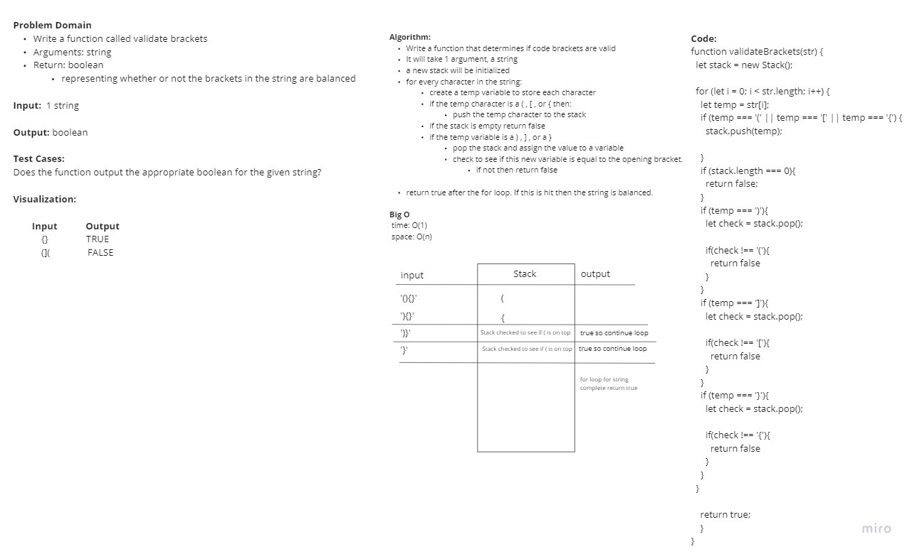

# Challenge Summary

Write a function called validate brackets

- Arguments: string
- Return: boolean
representing whether or not the brackets in the string are balanced

There are 3 types of brackets:

- Round Brackets : ()
- Square Brackets : []
- Curly Brackets : {}

## Whiteboard Process

## Approach & Efficiency

Our approach filters only the correct bracket pieces and adds them to a stack. When a closing piece comes, it's compared to the most recent piece in the stack. If a proper pair isn't formed, false is returned. If all pieces are gone through, true is returned. Time is O(n) since you have to cycle through all of the pieces.

## Solution

[Multi-Bracket Validation Code](./index.js)
[Multi-Bracket Validation Tests](./multi-bracket-validation.test.js)
