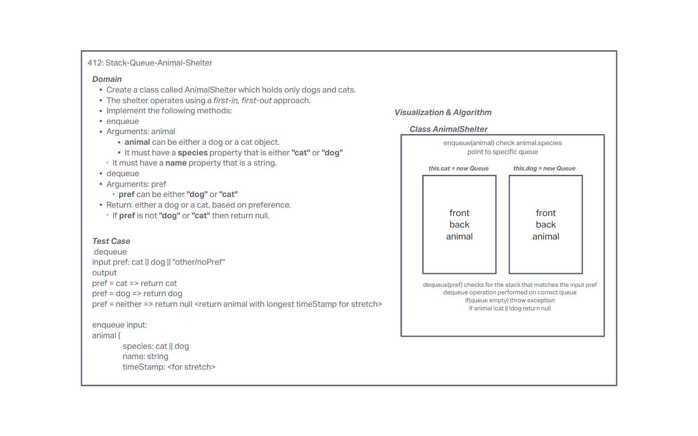

# Challenge Summary

Create a class called AnimalShelter which holds only dogs and cats. The shelter operates using a first-in, first-out approach. Implement the following methods:

- **enqueue**
- Arguments: animal
- animal can be either a dog or a cat object.
- It must have a species property that is either "cat" or "dog"
- It must have a name property that is a string.

- **dequeue**
- Arguments: pref
- pref can be either "dog" or "cat"
- Return: either a dog or a cat, based on preference.
- If pref is not "dog" or "cat" then return null.

## Whiteboard Process

## Approach & Efficiency

We decided to use a queue instance for each species type (cat & dog) and set them as this.cat & this.dog in the AnimalShelter class. This keeps the same FIFO queue functionality for each species and allows you to call the proper queue based on the species. For the stretch goal, we determined you could have a timestamp on each animal as they're pushed into the queue, and then just compare the front timestamp value through a peek() to determine which to dequeue from; our normal implementation just returns null with no pref fed to the dequeue. This all maintains the same O(1) time of a normal queue.

## Solution

[Stack and Queue Code](../stack-and-queue/index.js)
[Stack and Queue Tests](../stack-and-queue/__tests__/stack-and-queue.test.js)
