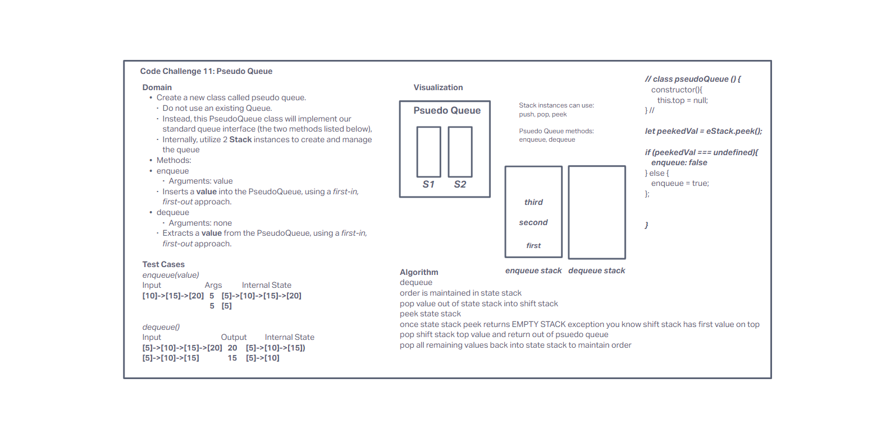

# Challenge Summary

Create a new class called pseudo queue.

- Do not use an existing Queue.
- Instead, this PseudoQueue class will implement our standard queue interface (the two methods listed below),
- Internally, utilize 2 Stack instances to create and manage the queue

## Whiteboard Process

## Approach & Efficiency

In whiteboarding, we came up with a solution that uses one stack for enqueue and one for dequeue. Peek is used to determine when a stack is empty while shifting between both stacks. No additional structures were used, so space is O(n). Time is O(n) when the nodes have to shift to the other stack.

## Solution

[Code](../stack-and-queue/index.js)
[Tests](../stack-and-queue/__tests__/stack-and-queue.test.js)
