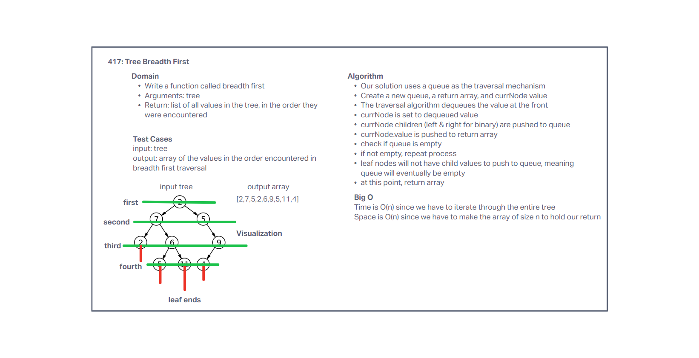

# Challenge Summary

Write a function called breadth first
Arguments: tree
Return: list of all values in the tree, in the order they were encountered

## Whiteboard Process

## Approach & Efficiency

Our solution uses a queue as the traversal mechanism, and creates an array to hold the return values.
Time is O(n) since we have to iterate through the entire tree.
Space is O(n) since we have to make the array of size n to hold our return.

## Solution

[Code](../tree/index.js)
[Tests](../tree/__tests__/tree.test.js)
