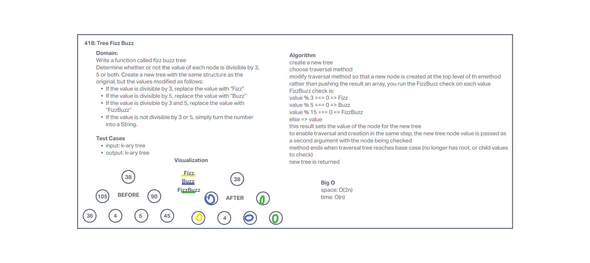

# Challenge Summary

Write a function called fizz buzz tree
Arguments: k-ary tree
Return: new k-ary tree
Determine whether or not the value of each node is divisible by 3, 5 or both. Create a new tree with the same structure as the original, but the values modified as follows:

- If the value is divisible by 3, replace the value with “Fizz”
- If the value is divisible by 5, replace the value with “Buzz”
- If the value is divisible by 3 and 5, replace the value with “FizzBuzz”
- If the value is not divisible by 3 or 5, simply turn the number into a String.

## Whiteboard Process

## Approach & Efficiency

Our approach was to use one of the existing traversal algorithms to piggyback on, while creating the new tree. Rather than pushing the results to a new output array, the FizzBuzz test was done on each value, and that new value was assigned to the current node. After traversal, the new tree was returned as output.

Creating another tree of size n made our space O(2n), and creating the new tree during the current traversal of all existing nodes made our time O(n).

## Solution

[Code](../tree/index.js)
[Tests](../tree/__tests__/tree.test.js)
