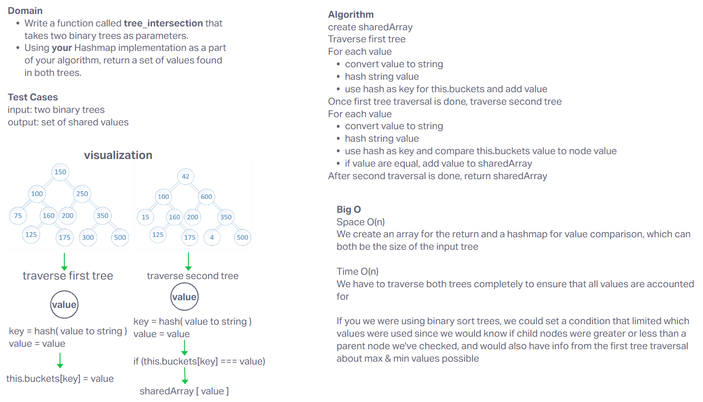

# Tree Intersection

Write a function called tree_intersection that takes two binary trees as parameters.
Using your Hashmap implementation as a part of your algorithm, return a set of values found in both trees.

## Whiteboard Process

## Approach & Efficiency

**Big O**
*Space O(n)*
We create an array for the return and a hashmap for value comparison, which can both be the size of the input tree.
*Time O(n)*
We have to traverse both trees completely to ensure that all values are accounted for.

If you we were using binary sort trees, we could set a condition that limited which values were used since we would know if child nodes were greater or less than a parent node we've checked, and would also have info from the first tree traversal about max & min values possible. This would change your traversal of the tree to increase efficiency by avoiding values that aren't relevant.

## Solution

[Code](../hashtable/index.js)
[Tests](../hashtable/__tests__/hashtable.test.js)
