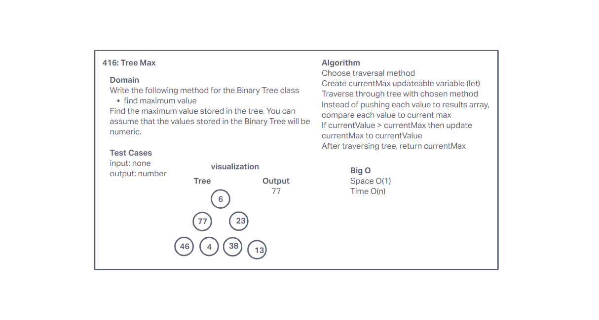

# Challenge Summary

Write a method for the Binary Tree class to the find maximum value
Arguments: none
Returns: number
Find the maximum value stored in the tree. You can assume that the values stored in the Binary Tree will be numeric.

## Whiteboard Process

## Approach & Efficiency

I chose to use a previous traversal method and replaced the output array with a variable to keep track of the max value. After traversal is done, the max value is returned. Big O space is O(1) since no additional data structures are used. Time is O(n) since it's required to traverse through all the values in the tree.

## Solution

[Code](../tree/index.js)
[Tests](../tree/__tests__/tree.test.js)
