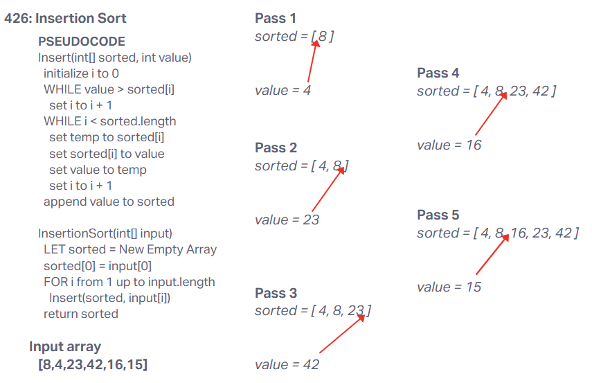

# Blog Notes: Insertion Sort

## Insertion Sort Psuedocode

```pseudocode
Insert(int[] sorted, int value)
  initialize i to 0
  WHILE value > sorted[i]
    set i to i + 1
  WHILE i < sorted.length
    set temp to sorted[i]
    set sorted[i] to value
    set value to temp
    set i to i + 1
  append value to sorted

InsertionSort(int[] input)
  LET sorted = New Empty Array
  sorted[0] = input[0]
  FOR i from 1 up to input.length
    Insert(sorted, input[i])
  return sorted
  ```

## Sample Array Step-Through



Starting array
[8,4,23,42,16,15]

- Pass 1
During pass one, a sorted array is created with input[0] added. This gives us sorted = [8]. The insert algorithm is then run with the sorted array and input[1], which gives us insert([8], 4). Within insert, we loop through our sorted array by initializing i to 0 to track our current index and incrementing i after each loop.

The first WHILE loop checks to see if value is greater than sorted[i]; sorted[0] > value, so this loop is not entered.

The next WHILE loop sets sorted[i] to a temp value, sets sorted[i] to value, sets value to temp, and increments i by one; this loop continues until i is no longer less than the length of the sorted array.  For this current pass, this loop sets sorted[0] = 4 and value = 8 before i is incremented by 1 (i = 1), and exits WHILE due to 1 not being less than sorted.length (1).

Finally, value (8) is appended to sorted; sorted = [4,8].

- Pass 2
InsertionSort FOR loop increments i and feeds insert([4,8], 23).

i is initialized to 0, and value (23) is greater than sorted[0], so the first WHILE loop is entered. i is incremented by 1, and value is still greater than sorted[1], so i is incremented again. sorted[2] is undefined, so value > undefined evaluates to false and the loop is exited.

i (2) is not less than sorted.length (2), so the second WHILE loop is not entered.

value (23) is appended to sorted; sorted = [4,8,23].

- Pass 3
InsertionSort FOR loop increments i and feeds insert([4,8,23], 42).

i is initialized to 0, and value (42) is greater than sorted[0], so the first WHILE loop is entered. Since value (42) is greater than all sorted[] values, WHILE loop is exited once sorted[i] = undefined; i = 3.

i (3) is not less than sorted.length (3), so the second WHILE loop is not entered.

value (42) is appended to sorted; sorted = [4,8,23,42].

- Pass 4
InsertionSort FOR loop increments i and feeds insert([4,8,23,42], 16).

i is initialized to 0, and value (16) is greater than sorted[0], so the first WHILE loop is entered. value is no longer greater than sorted[i] once i is incremented to 2, so the first loop is exited.

i (2) is less than sorted.length (4), so the second WHILE loop is entered. This loop sets sorted[2] (23) to temp, sorted[2] to value (16), value to temp (23), and increments i by 1. This pattern repeats with each index of sorted until i is no longer less than sorted.length (4), setting the array to [4,8,16,23] and value to 42.

value (42) is appended to sorted; sorted = [4,8,16,23,42].

- Pass 5
InsertionSort FOR loop increments i and feeds insert([4,8,16,23,42], 15).

i is initialized to 0, and value (15) is greater than sorted[0], so the first WHILE loop is entered. value is no longer greater than sorted[i] once i is incremented to 2, so the first loop is exited.

i (2) is less than sorted.length (5), so the second WHILE loop is entered. This loop sets sorted[2] (16) to temp, sorted[2] to value (15), value to temp (16), and increments i by 1 (3). This pattern repeats with each index of sorted until i is no longer less than sorted.length (5), setting the array to [4,8,15,16,23] and value to 42.

value (42) is appended to sorted; sorted = [4,8,15,16,23,42].

At this point, InsertionSort FOR loop is exited and sorted[] is returned; output array = [4,8,15,16,23,42].

## Efficiency

Space: a new array is created that is the size of the input array, so O(n).
Time: the algorithm loops through all elements, and then also internally loops through all elements in the internal arrya, so O(n^2).

## Implementation

[Code](index.js)
[Tests](./__test__/insertion-sort.test.js)
