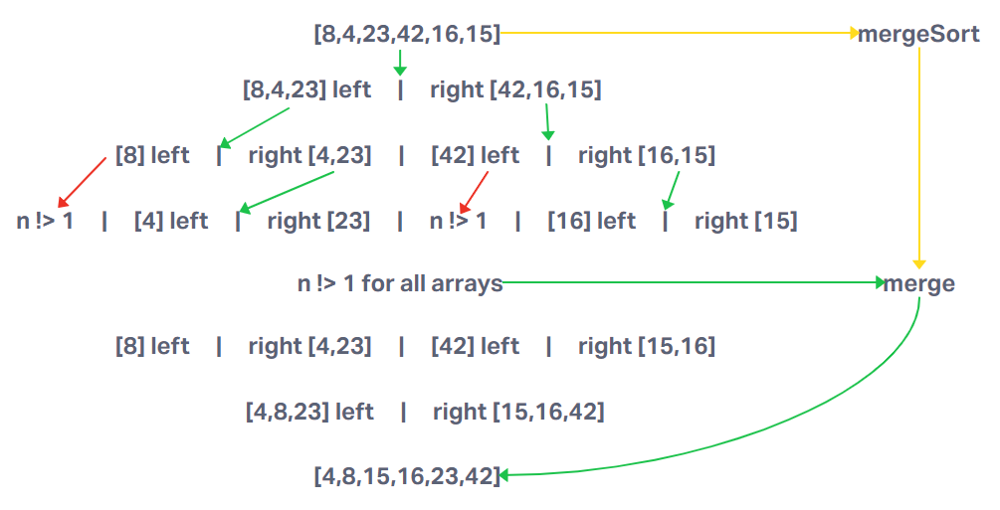

# Blog Notes: Merge Sort

## Merge Sort Psuedocode

```pseudocode
ALGORITHM Mergesort(arr)
    DECLARE n <-- arr.length

    if n > 1
      DECLARE mid <-- n/2
      DECLARE left <-- arr[0...mid]
      DECLARE right <-- arr[mid...n]
      // sort the left side
      Mergesort(left)
      // sort the right side
      Mergesort(right)
      // merge the sorted left and right sides together
      Merge(left, right, arr)

ALGORITHM Merge(left, right, arr)
    DECLARE i <-- 0
    DECLARE j <-- 0
    DECLARE k <-- 0

    while i < left.length && j < right.length
        if left[i] <= right[j]
            arr[k] <-- left[i]
            i <-- i + 1
        else
            arr[k] <-- right[j]
            j <-- j + 1

        k <-- k + 1

    if i = left.length
       set remaining entries in arr to remaining values in right
    else
       set remaining entries in arr to remaining values in left
  ```

## Sample Array Step-Through



Starting array
[8,4,23,42,16,15]

- mergeSort Top
The top of this algorithm takes in an inputArray, creates a mergedArray, and then enters into a conditional.

If the length of inputArray is greater than one, a recursiver loop is entered.

If inputArray.length is not greater than one, mergedArr is set to inputArray.

- recursive loop
The midpoint of the array is found, and the inputArray is split into two based on the midpoint. leftArr is inputArray indices 0 to (but not including) mid, rightArr is mid to last. mergeSort is called with leftArr & rightArr, and they are both set as the returns. This continues this pattern until each array is broken down into singular elements.

After making it past mergeSort invokations, merge is called with leftArr, rightArr, and mergedArr as arguments.

- merge
merge receives empty leftArr, rightArr, and mergedArr. i, j, and k are declared as 0 and used to track the current index for each array. As long as we haven't gone through all elements of either array (i < leftArr.length && j < rightArr.length), then we enter into a WHILE loop. In the loop, a conditional checks to see if the current leftArr element (leftArr[i]) is less than or equal to the current rightArr element (rightArr[j]). If so, the current mergedArr index (mergedArr[k]) is set to the leftArr element, otherwise it is set to the rightArr element. The index tracker for the chosen array is incremented, as well as the index tracker for the mergedArr tracker.

The WHILE loop is exited once one array has gone through all of the elements, and another conditional is used to add the remaining elements from the other array to mergedArr.

This merge function sorts the leftArr and rightArr elements by value, lowest to greatest, and adds them to mergedArr, and then returns mergedArr.

-mergeSort return
At the end of these recursive calls, mergedArr is a sorted array, and is returned.

## Efficiency

Space: a new array is created that is the size of the input array, so O(n).
Time: inputArray is divided by two during each step of the first half (logn), then all elements are looped through in the second half (n), so O(nlogn).

## Implementation

[Code](index.js)
[Tests](./__tests__/merge-sort.test.js)
